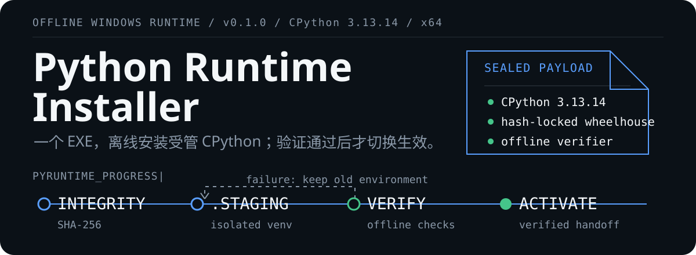

<p align="center">
  
</p>

<p align="center">
  <a href="./docs/user-guide.md">用户指南</a> ·
  <a href="./.github/workflows/build-installer.yml">构建流程</a> ·
  <a href="./docs/security-release.md">安全与发布</a> ·
  <a href="./docs/troubleshooting.md">故障排查</a>
</p>

Python Runtime Installer 用一个 Windows EXE 交付固定的 CPython `3.13.14` x64
环境。目标电脑安装时不需要管理员权限，也不访问 PyPI；安装器只有在 payload、依赖和
功能检查全部通过后才会启用新环境。

> [!IMPORTANT]
> 当前代码版本是 `0.1.0`。仓库目前没有 Git tag 或 GitHub Release，Windows 10 和
> Windows 11 的实机验收记录也尚未完成。与待验收提交对应的成功 Actions artifact
> 可用于继续验收，但 `0.x` 不应当作稳定版分发。

## 安装后会得到什么

| 项目 | 当前合同 |
| --- | --- |
| 目标平台 | Windows 10/11 x64 桌面系统，至少 2 GB 可用空间 |
| Python | CPython `3.13.14` x64，以及 14 个直接依赖和哈希锁定的传递依赖 |
| 安装方式 | 当前用户固定目录，不要求管理员权限，不修改持久化用户或系统 `PATH`，不创建桌面快捷方式 |
| 环境入口 | 开始菜单中的 `Open Python Environment Terminal` |
| 生命周期 | 首次安装、同版本检查与修复、向前升级、卸载 |
| 日志 | 本机 UTF-8 英文技术日志，最多保留 20 份，不上传遥测 |

安装器只复用完全健康的标准 CPython `3.13.14` x64。其他版本、Microsoft Store
alias、Conda、嵌入式发行版或损坏的解释器不会被修改，安装器会改用自己的私有
Python。

<details>
<summary>查看 14 个直接运行时依赖</summary>

`beautifulsoup4`、`faker`、`flask`、`matplotlib`、`mysql-connector-python`、
`networkx`、`numpy`、`openpyxl`、`paho-mqtt`、`pandas`、`scikit-learn`、
`seaborn`、`selenium`、`webdriver-manager`。

构建流程把所有直接和传递依赖固定到精确版本与 SHA-256，并且只接受适用于
CPython 3.13.14 Windows x64 的 wheel。

</details>

## 安装与首次验证

安装包应来自可信的内部文件服务器、企业存储，或成功的
[`Build Windows installer`](https://github.com/alune1212/python-runtime-installer/actions/workflows/build-installer.yml)
工作流 artifact。当前没有公开 Release 可供下载。

把 EXE 和同一构建产物中的 `SHA256SUMS.txt` 放在一个目录，然后在 PowerShell 中校验。
下面以未签名的 `0.1.0` 安装包为例：

```powershell
Get-FileHash .\python-runtime-installer-0.1.0-windows-x64-unsigned.exe -Algorithm SHA256
Get-Content .\SHA256SUMS.txt
```

两个 SHA-256 必须一致。未签名构建可能触发 SmartScreen；只有文件来自可信来源且哈希
匹配时才应继续运行。

双击 EXE，选择简体中文或英文并等待安装完成。然后从开始菜单打开
`Open Python Environment Terminal`：

```bat
python --version
```

预期输出：

```text
Python 3.13.14
```

更细的操作说明、第一段 Python 代码和卸载步骤见
[用户指南](docs/user-guide.md)。

### 静默安装

```bat
python-runtime-installer-0.1.0-windows-x64-unsigned.exe /VERYSILENT /SUPPRESSMSGBOXES /NORESTART /LOG="C:\Temp\python-runtime-setup.log"
```

返回码 `0` 表示 payload、Python、锁定依赖和内置离线检查均已通过。自动化部署需要保存
进程退出码和 `/LOG` 文件。

## 安装器如何工作

实际进度按以下阶段推进：

```text
preflight -> integrity -> python-discovery -> venv-create -> verification -> activation -> complete
```

1. 构建流程校验 CPython、Inno Setup、wheel 和许可证来源，并生成 wheelhouse、
   payload manifest、SBOM 与发布证据。
2. 目标电脑先验证内置 payload 的 SHA-256，再在同卷 `.staging` 目录创建隔离环境。
3. `pip --no-index` 只从内置 wheelhouse 安装锁定依赖。安装器不会读取 EXE 旁的
   requirements，也不接受临时追加包。
4. staging 环境通过架构、路径、`pip check`、版本、导入和离线功能测试后，安装器才
   切换活动环境。失败时会恢复上一环境，并保留诊断日志。

再次运行同版本会先检查现有环境。环境健康时无需重建；发现漂移或损坏时，安装器会重新
创建受管环境。新版本只允许向前升级，旧版安装器会拒绝降级。

## 兼容性与限制

- 只支持 Windows 10/11 x64 桌面系统，不支持 ARM64、32 位 Windows 或 Windows
  Server。
- 受管环境不是个人长期维护的 venv。用户自行执行 `pip install` 添加的包可能在修复或
  升级时被清除，代码和数据应放在安装目录之外。
- 首版包含 Selenium 与 webdriver-manager 的 Python 包，但不捆绑浏览器或 WebDriver，
  安装和内置验证也不会下载或启动它们。后续浏览器自动化仍需组织另行准备兼容组件。
- "完全离线" 指目标电脑上的安装和内置验证。安装完成后的业务代码是否需要网络，取决于
  代码本身。
- 卸载只删除安装器拥有的文件。复用的外部 Python 不会被删除，诊断日志会继续保留。
- 如需降级，必须先卸载当前版本，再安装经过校验的旧版。

## 开发与源码验证

开发环境使用仓库固定的 UV `0.11.29`。安装 UV 和 OpenSpec 后运行：

```bash
uv sync --frozen
uv lock --check
uv run ruff format --check .
uv run ruff check .
uv run pytest
uv run python -m scripts.build.validate_config
uv run python -m scripts.build.lock_requirements --check
uv run python -m scripts.build.validate_vulnerability_exceptions
uv run python -m scripts.build.validate_desktop_acceptance
uv run python -m scripts.build.scan_repository
openspec validate --all --strict
```

这些检查可在 macOS 或 Linux 上运行，但不能替代 Windows EXE 的编译和生命周期测试。
依赖刷新使用：

```bash
uv run python -m scripts.build.lock_requirements --upgrade
uv lock --upgrade
uv sync --frozen
```

刷新后必须审阅 `requirements.txt`、`bootstrap-requirements.txt` 和 `uv.lock` 的 diff。
不要手工删除哈希或放宽版本。

## Windows 构建

主构建入口是 GitHub Actions 中的
[`Build Windows installer`](https://github.com/alune1212/python-runtime-installer/actions/workflows/build-installer.yml)。
它在 `windows-2025` 上运行 Python、Pester 和 PSScriptAnalyzer 门禁，构建离线
payload 与 Inno Setup EXE，再测试真实 EXE 的安装、修复和卸载。手动触发只上传
artifact，不会创建 Release。

<details>
<summary>在 Windows Runner 上复现主要构建步骤</summary>

以下命令用于贴近 CI 的排障。工作流文件仍是构建合同的唯一准则。

```powershell
$managedPythonKey = 'cpython-3.13.14-windows-x86_64-none'
$temporaryRoot = if ($env:RUNNER_TEMP) { $env:RUNNER_TEMP } else { [IO.Path]::GetTempPath() }
$managedPythonRoot = Join-Path $temporaryRoot 'python-runtime-installer-build-python'
$env:UV_PYTHON_INSTALL_DIR = $managedPythonRoot
uv python install --no-registry --no-bin $managedPythonKey
$buildPython = @(
    uv --directory $temporaryRoot python find `
        --no-project `
        --managed-python `
        --no-python-downloads `
        --resolve-links `
        $managedPythonKey
) -join ''
uv sync --frozen --python $buildPython
uv run python -m scripts.build.audit_dependencies
Install-Module Pester -RequiredVersion 5.7.1 -Scope CurrentUser -Force
Install-Module PSScriptAnalyzer -RequiredVersion 1.24.0 -Scope CurrentUser -Force
Invoke-ScriptAnalyzer -Path scripts -Recurse -Settings config/PSScriptAnalyzerSettings.psd1
Invoke-Pester -Path tests/powershell -CI -Output Detailed
.\scripts\build\Prepare-Payload.ps1 -PythonExecutable $buildPython
$compiler = .\scripts\build\Install-InnoSetup.ps1
.\scripts\build\Compile-Installer.ps1 -InnoCompiler $compiler -BuildCommit local
.\scripts\build\Test-Installer.ps1 `
    -InstallerPath .\installer\output\python-runtime-installer-0.1.0-windows-x64-unsigned.exe `
    -ReusablePythonPath $buildPython
.\scripts\build\Finalize-Release.ps1
```

</details>

## 发布与中国大陆分发

只有与 `config/product.json` 匹配的 `vX.Y.Z` tag 在全部门禁通过后才会创建 GitHub
Release。`0.x` 会标记为 prerelease。签名凭据齐全时，流程会生成并验证 Authenticode
签名；否则文件名会带 `-unsigned`，并附带未签名说明。

目标电脑安装时不需要国内 PyPI 镜像。构建流程从官方来源下载并校验依赖，再把 wheelhouse
封装进 EXE。中国大陆或内网分发应复制同一构建的完整产物，并使用
`SHA256SUMS.txt` 复核 EXE；不要拆包、替换 wheel，或为改动后的文件沿用原校验值。

自动发布只面向 GitHub Releases，不会同步国内平台或内部服务器。稳定版 `1.0.0` 之前，
还必须记录至少一台真实 Windows 10 x64 和一台 Windows 11 x64 电脑的验收结果。详见
[安全与发布](docs/security-release.md)和
[Windows 真实设备验收清单](docs/windows-acceptance-checklist.md)。

<details>
<summary>固定路径与发现信息</summary>

| 内容 | 位置 |
| --- | --- |
| 应用 | `%LOCALAPPDATA%\Programs\Python Runtime Installer` |
| Python | `%LOCALAPPDATA%\Programs\Python Runtime Installer\venv\Scripts\python.exe` |
| manifest | `%LOCALAPPDATA%\Programs\Python Runtime Installer\manifest.json` |
| 日志 | `%LOCALAPPDATA%\PythonRuntimeInstaller\Logs` |
| 注册表 | `HKCU\Software\Alune\Python Runtime Installer` |

日志记录阶段、脱敏命令摘要、退出码和错误，不记录完整环境变量、token、证书或用户文件
内容。卸载后如需删除保留日志，请按[故障排查](docs/troubleshooting.md)操作。

</details>

<details>
<summary>项目结构</summary>

```text
.github/workflows/             CI、Windows 构建发布、每月依赖更新 PR
config/                        产品、运行时、哈希、漏洞例外策略
docs/                          用户指南、故障排查、安全发布、真实设备验收
installer/                     Inno Setup 工程及生成常量
scripts/build/                 锁定、wheelhouse、SBOM、许可证、签名、发布
scripts/windows/               PowerShell 5.1 安装、事务、检测、卸载
scripts/verify_environment.py  目标环境离线验证器
tests/                         Python 与 Windows PowerShell 合同测试
bootstrap-requirements.*       受管 pip 的独立哈希锁
requirements.in                14 个获准直接依赖
requirements.txt               Windows CPython 3.13 的完整哈希锁
pyproject.toml / uv.lock       开发与 CI 工具环境
```

</details>

## 文档

| 文档 | 用途 |
| --- | --- |
| [用户指南](docs/user-guide.md) | 面向第一次使用 Python 的安装、验证和卸载步骤 |
| [故障排查](docs/troubleshooting.md) | 平台、修复、浏览器和日志问题 |
| [安全与发布](docs/security-release.md) | 签名、漏洞门禁、发布证据和再分发规则 |
| [Windows 真实设备验收清单](docs/windows-acceptance-checklist.md) | `1.0.0` 前的实机验收要求 |
| [0.1.0 发布说明](docs/release-notes-0.1.0.md) | 当前预发布版本内容 |

## 许可证

本项目使用 [MIT License](LICENSE)。
